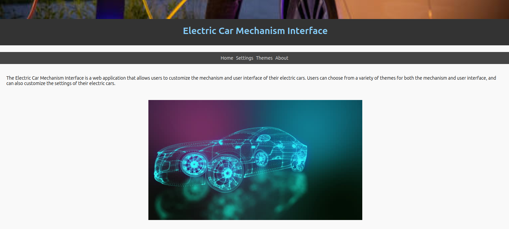

# Tokyo TCG Hub & Star Bazaar

Welcome to **Tokyo TCG Hub & Star Bazaar** – the ultimate retro-inspired, AI-powered hub where electrified trading card duels meet futuristic car customization! This immersive interface fuses advanced electric car tech with gamified quests, dynamic challenges, and interactive digital tools, tailored for tech enthusiasts and car aficionados alike.


[Play the App!](https://kvnbbg.github.io/500Discount/index.html)



This web application offers a seamless one-screen experience featuring:
- **Retro Visuals & Animated Ambiance:** Enjoy an animated, neon-lit gradient background with pulsing retro fonts for that authentic arcade feel.
- **Dynamic AI Insights:** Our AI loop delivers a mix of facts, giveaways, inspiring quotes, and imaginative landscape descriptions.
- **Gamified Quests:** Transform routine tasks into epic quests—complete challenges related to tech and electric car customization to earn rewards and boost your score.
- **Advanced Customization:** Tailor electric car mechanisms and diverse UI themes to build your ultimate futuristic ride.
- **Integrated Tools:** Engage with an interactive task manager, tackle a challenging coin game, use a handy math calculator, and quickly capture ideas with “Some time as Mémo.”
- **Responsive Design:** Optimized for mobile, desktop, and Mac environments, all in a smooth one-screen layout.

## Overview

**Tokyo TCG Hub & Star Bazaar** invites you to:
- **Customize Your Ride:** Select from an array of mechanism set themes (e.g., Space, Town Worker, Hydrogen, Hydro-electric) and interface styles (e.g., Sexy, Japanese, Serious, Hacker-shade) to power your electric car.
- **Embark on Quests:** Engage in gamified tasks designed as quests where each challenge—such as optimizing your card deck—earns you rewards and unlocks tech upgrades.
- **Experience AI-Powered Inspiration:** Let our dynamic AI loop share a medley of interesting facts, giveaways, inspiring quotes, and vivid, imaginative descriptions to spark your creativity.
- **Stay Organized with “Some time as Mémo”:** Replace traditional virtual desktops with a simple note-taking feature to capture your ideas and progress.

## Features 🌟

- **Retro-Themed UI & Animations:** An animated gradient backdrop and pulsing retro fonts set the stage for a nostalgic arcade experience.
- **Dynamic AI Insights:** Enjoy AI messages such as:
  - *"Did you know? Electric cars are redefining the future of mobility."*
  - *"Quote: 'Innovation distinguishes between a leader and a follower.' – Steve Jobs."*
  - *"Giveaway: Earn bonus points on your next quest!"*
  - *"Landscape: Imagine a neon cityscape where every card sparks a revolution."*
- **Gamified Quest System:** Transform everyday tasks into quests. Complete challenges—like powering up your card deck or fine-tuning tech parameters—to earn rewards and level up.
- **Electric Car Customization:** Dive into tech-driven customization options for your electric ride.
- **Integrated Tools:** Manage quests with an interactive task manager, challenge yourself with a coin game, use an intuitive math calculator, and record notes quickly with “Some time as Mémo.”
- **Responsive & Seamless:** Designed for one-screen usability on any device, ensuring a smooth, engaging experience.

## Getting Started

To run the **Tokyo TCG Hub & Star Bazaar** interface locally:

1. **Clone** the repository:
    ```bash
    git clone https://github.com/kvnbbg/500Discount.git
    ```
2. Navigate to the project directory:
    ```bash
    cd 500Discount
    ```
3. Open the `index.html` file in your browser to launch the application.

## Technologies Used

- **HTML** for structuring the webpage.
- **CSS** for stylish animations and responsive design.
- **JavaScript** for dynamic interactions and gamified functionalities.
- (Optional) **Web3.js** for potential blockchain integration and NFT support.

## Folder Structure

- `index.html`: The main HTML file integrating all features.
- `assets/pictures/`: Directory containing images and assets.
- *(Additional files such as separate CSS or JS files may be added as needed.)*

## Usage

1. **Customize & Quest:** Use the interface to select your mechanism and UI themes, then embark on quests that challenge you to complete tech-themed tasks for rewards.
2. **Engage with AI:** Let our dynamic AI loop inspire you with fun facts, quotes, and creative messages.
3. **Take Quick Notes:** Utilize “Some time as Mémo” to jot down your ideas and keep track of progress.
4. **Explore Interactive Tools:** Enjoy the coin game challenge, math calculator, and file management features for a fully interactive experience.

## Credits

This project was created by **Kvnbbg** as part of the visionary **Tokyo TCG Hub & Star Bazaar** concept—where the future of tech, electric car customization, and trading card excitement collide.

## Contributing

Contributions are welcome! Fork the repository and submit a pull request with your enhancements or fixes.

## License

This project is licensed under the Mozilla License – see the [LICENSE](LICENSE) file for details.